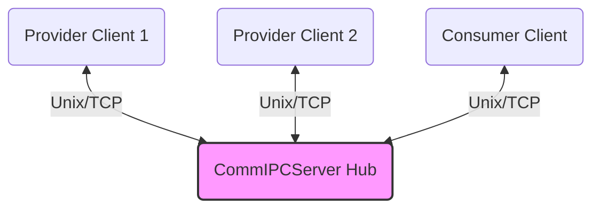
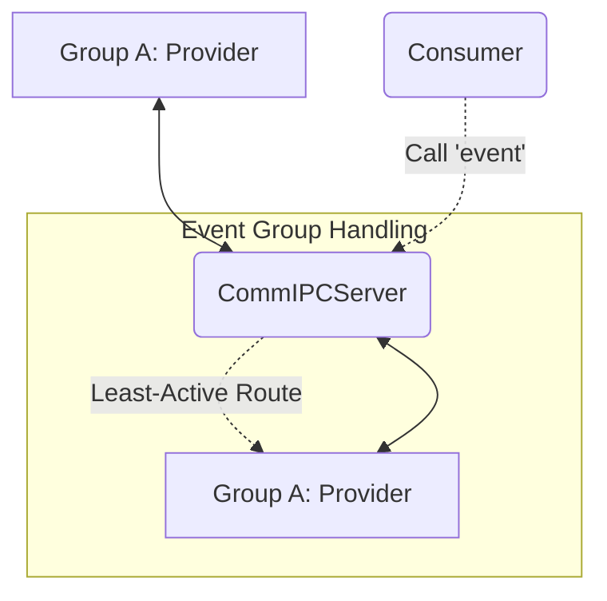
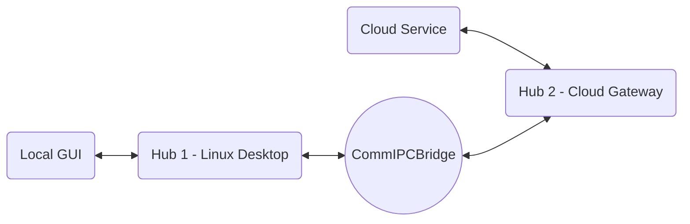
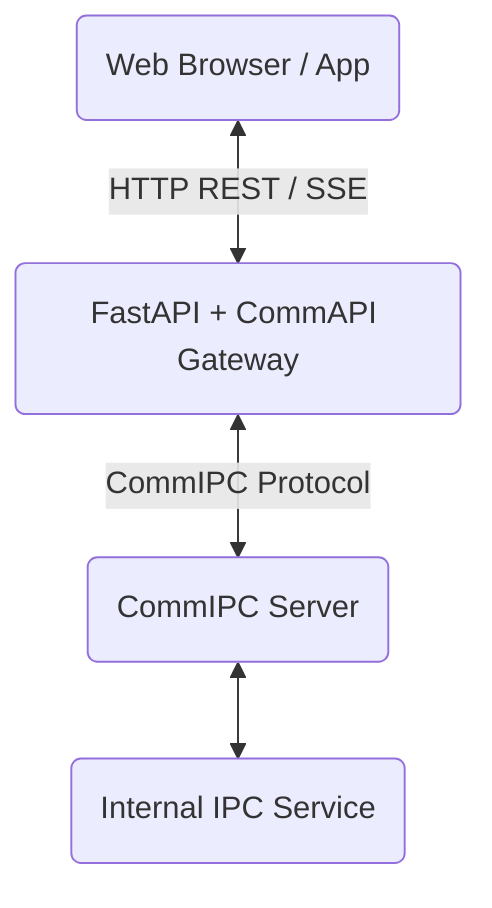

# CommIPC Architecture

The following diagrams illustrate the core architectural topologies possible with CommIPC. Agents should use these to understand the networking layer before writing complex routing logic.

## 1. Hub-and-Spoke (Standard Topology)

*Note: Clients never speak directly to each other. The server routes all messages using `sender_id` and `target_id` (or broadcasts).*

## 2. Load-Balanced Event Groups

*Note: If multiple providers register to the same group event, the server automatically distributes the load.*

## 3. Bridge Federation (Multi-Hub)

*Note: The `CommIPCBridge` acts as a transparent proxy. `C1` can call `C2` exactly as if they were on the same local server.*

## 4. FastAPI Gateway Topology

*Note: The Gateway transparently translates HTTP/JSON into type-safe CommData models, routing them to the internal IPC mesh.*
