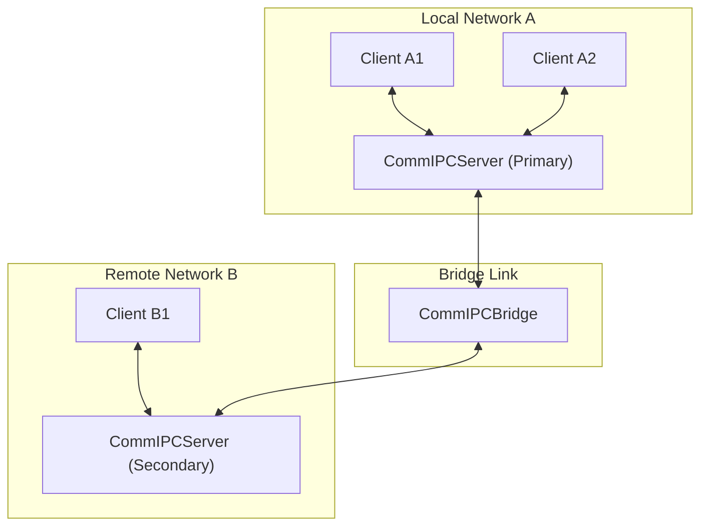

# CommIPC: Asynchronous Secure Distributed Inter-Process Communication

CommIPC is an asynchronous Inter-Process Communication (IPC) system designed for Linux environments. Written in pure Python, it provides communication through Unix Domain Sockets for local processes and TCP for cross-network communication, featuring integrated bridging, synchronization, and security mechanisms.

## Table of Contents

- [Key Features](#key-features)
- [Architecture Overview](#architecture-overview)
- [Components](#components)
- [Usage Guide](#usage-guide)
    - [Basic RPC (Request-Response)](#basic-rpc-request-response)
    - [Streaming Responses](#streaming-responses)
    - [Cross-Network Bridging](#cross-network-bridging)
- [Performance and Scalability](#performance-and-scalability)
- [Testing](#testing)
- [License](#license)

## Key Features

- **Zero-Trust Security**:
    - **HMAC-SHA256 Handshake**: Mandatory cryptographic challenge for every client connection.
    - **End-to-End Signature**: All channel messages are signed with HMAC-SHA256 based on channel passwords, ensuring data integrity even if the server is compromised.
- **Advanced Channel Management**:
    - **Owner-Based Administration**: The first client to join a channel is the Admin/Owner, with exclusive rights to manage security.
    - **Explicit Password Protection**: Support for protecting channels (including system channels) with unique, cryptographically derived keys.
    - **Flexible Lifecycle Policies**: Configurable policies for handling owner disconnection (`terminate` or `promote`).
- **High Resilience**:
    - **Auto-Reconnect**: Robust reconnection logic with exponential backoff and transparent state restoration (channels, providers).
    - **Synchronous Persistence**: Client APIs wait for server confirmation for registrations and security changes, preventing communication hangs.
- **Dependency-Free**: Implemented entirely using the Python standard library, requiring no external packages.

## Architecture Overview

The system operates as a hub-and-spoke model locally, which can be extended into a mesh or linear topology using bridges.



## Components

- **CommIPCServer**: The central message coordinator responsible for client lifecycle management, authentication, and message routing.
- **CommIPC**: The primary client interface for application integration.
- **CommIPCChannel**: A high-level abstraction layer for interacting with specific logical communication channels.
- **CommIPCBridge**: A specialized interconnect service that synchronizes providers and subscribers across discrete server instances.

## Usage Guide

### Basic RPC (Request-Response)

#### Service Provider

```python
import asyncio
from comm_ipc.client import CommIPC

async def main():
    client = CommIPC(client_id="math_service")
    channel = await client.open("math_operations")
    
    def add(params):
        return params.data["a"] + params.data["b"]
        
    await channel.add_event("sum", call=add)
    
    # Maintain the service loop
    await asyncio.Future() 

if __name__ == "__main__":
    asyncio.run(main())
```

#### Service Consumer

```python
import asyncio
from comm_ipc.client import CommIPC

async def main():
    client = CommIPC(client_id="application_client")
    channel = await client.open("math_operations")
    
    response = await channel.event("sum", {"a": 15, "b": 25})
    print(f"Calculated Sum: {response.data}") # Expected Output: 40

if __name__ == "__main__":
    asyncio.run(main())
```

### Streaming Responses

#### Stream Provider

```python
async def sequence_generator(request):
    n = request.data.get("limit", 10)
    for i in range(n):
        yield i
        await asyncio.sleep(0.05)

await channel.add_stream("data_feed", call=sequence_generator)
```

#### Stream Consumer

```python
async for chunk in channel.stream("data_feed", {"limit": 5}):
    print(f"Received Chunk: {chunk.data}")
```

### Cross-Network Bridging

```python
from comm_ipc.bridge import CommIPCBridge

# Establishes a link between a local Unix socket and a remote TCP server
bridge = CommIPCBridge(socket_path1="/tmp/local_service.sock")
await bridge.connect(
    target1_params={}, 
    target2_params={"host": "192.168.1.100", "port": 9000}
)
```

### Security & Channel Management

#### Protecting a Channel (Owner)

```python
# The first client to open the channel becomes the owner
channel = await client.open("secure-data")
await client.set_password("secure-data", "strong-password")
```

#### Joining a Protected Channel

```python
# Fails if password is wrong or missing
channel = await client.open("secure-data", password="strong-password")
```

## Performance and Resilience

CommIPC is optimized for reliability:
- **Auto-Reconnect**: Automatically recovers from server restarts and network interruptions.
- **State Preservation**: Transparently restores all active channel memberships and event providers after a reconnection event.
- **Unix Domain Sockets**: Minimizes latency for local-host communication by bypassing the network stack.

## Testing

The project maintains a comprehensive verification suite located in the `tests/` directory.

```bash
# Execute the full validation suite
PYTHONPATH=. pytest tests/
```

The test coverage includes:
- **Zero-Trust Verification**: HMAC handshakes, signature integrity, and E2E verification.
- **Advanced Management**: Ownership logic, lifecycle policies, and resource cleanup.
- **Resilience**: Auto-reconnect stability and state restoration.
- **Distributed Systems**: Bridge synchronization and circular path detection.
- **Streaming**: Asynchronous iterator support across local and remote instances.

## License

This project is licensed under the LGPLv3 License.
