# CommIPC Architectural Patterns

CommIPC is highly flexible. Because it natively supports RPC, Pub/Sub, load-balanced groups, and high-performance routing, it can be used to implement almost any modern distributed systems architecture.

This document serves as a guide for implementing 14 common architectural patterns using CommIPC primitives.

---

## 1. Scatter-Gather
A central client broadcasts a task to multiple workers. The workers process the task in parallel and return the results to the client.

**CommIPC Implementation**:
The client publishes an event to a topic including an `aggregation_id`. Multiple workers subscribe to the topic, do the work, and send their results back via a designated RPC channel using the `aggregation_id`. The client waits for a specific aggregation timing window to gather the responses.

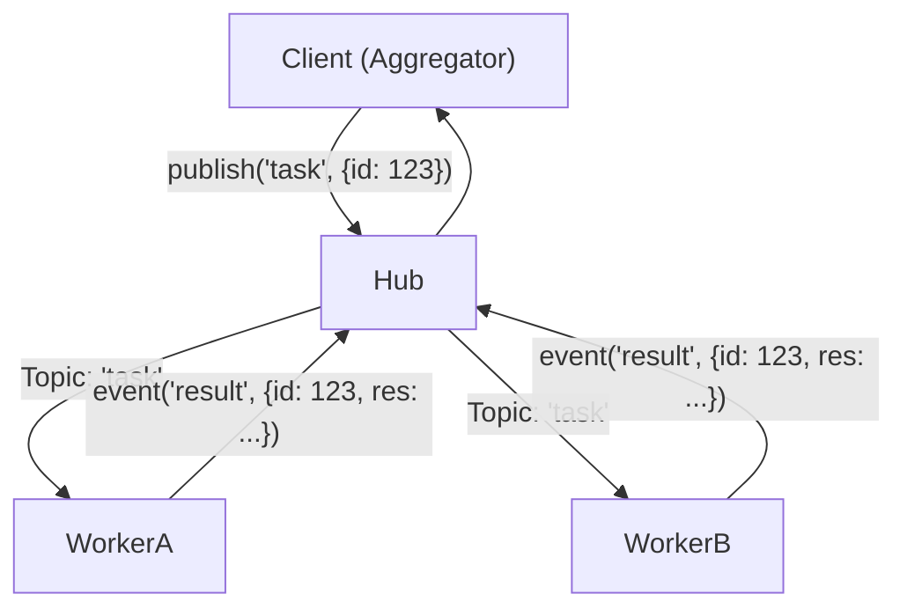

**Snippet**:
```python
# Client Side
results = []
AGGREGATION_WINDOW_SECS = 2.0

async def gather_results(cd: CommData):
    # Only accept responses that match our aggregation ID
    if cd.data["agg_id"] == current_agg_id:
        results.append(cd.data["result"])

@app.provide("submit_result")
async def _(cd: CommData): await gather_results(cd)

# Trigger and wait
await channel.publish("task_topic", {"agg_id": "job-1", "work": "..."})
# Wait for the aggregation window to close
await asyncio.sleep(AGGREGATION_WINDOW_SECS) 
print(f"Gathered {len(results)} responses.")
```

---

## 2. Request-Response
A standard synchronous (from the caller's perspective) remote procedure call.

**CommIPC Implementation**:
Native RPC using `@app.provide` and `channel.event`.

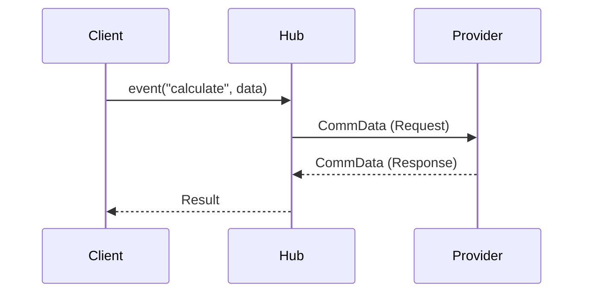

---

## 3. Publish-Subscribe (Pub/Sub)
One-to-many communication where publishers emit events without knowing who the subscribers are.

**CommIPC Implementation**:
Native pub/sub using `@app.subscription` and `channel.publish`.

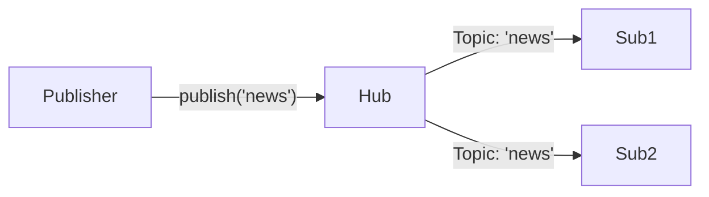

---

## 4. Event Sourcing
State is determined by a sequence of events rather than saving current state in a database table. 

**CommIPC Implementation**:
All microservices publish state-change events. A dedicated "EventStore" service subscribes to these events and appends them to a log/database. Other services subscribe to reconstruct materialized views.

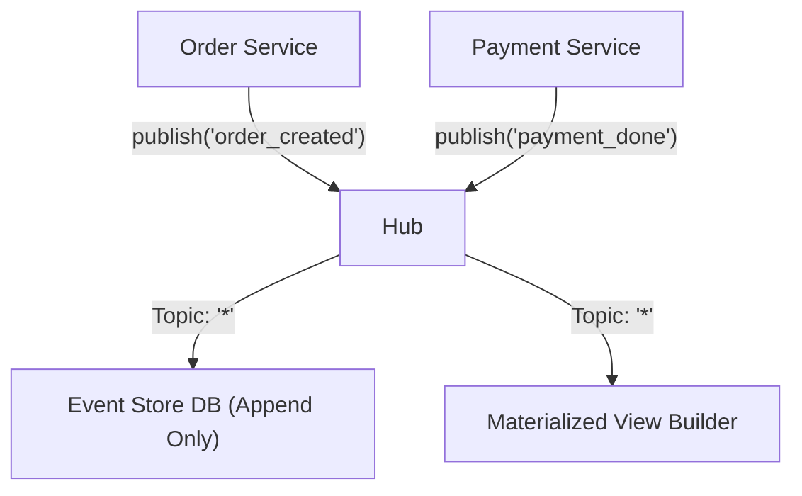

---

## 5. Command Query Responsibility Segregation (CQRS)
Separating the data mutation operations (Commands) from data retrieval operations (Queries).

**CommIPC Implementation**:
Use distinct channels or event prefixes. `write_channel` handles all mutations. `read_channel` handles all queries and can be heavily load-balanced using `@app.group`.

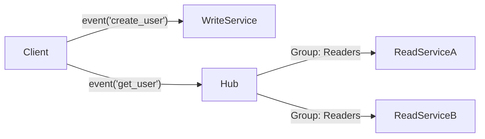

---

## 6. Pipe and Filter
Data flows through a sequence of processing components (filters).

**CommIPC Implementation**:
Daisy-chaining CommIPC streams or pub/sub topics. 

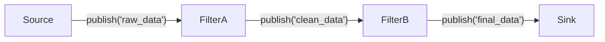

---

## 7. Saga Pattern
Managing distributed transactions across multiple microservices without 2-phase commit.

**CommIPC Implementation (Orchestration)**:
A central coordinator client makes sequential `channel.event` RPC calls. If a step fails, the coordinator catches the exception and issues compensation RPC calls (`rollback_payment`).

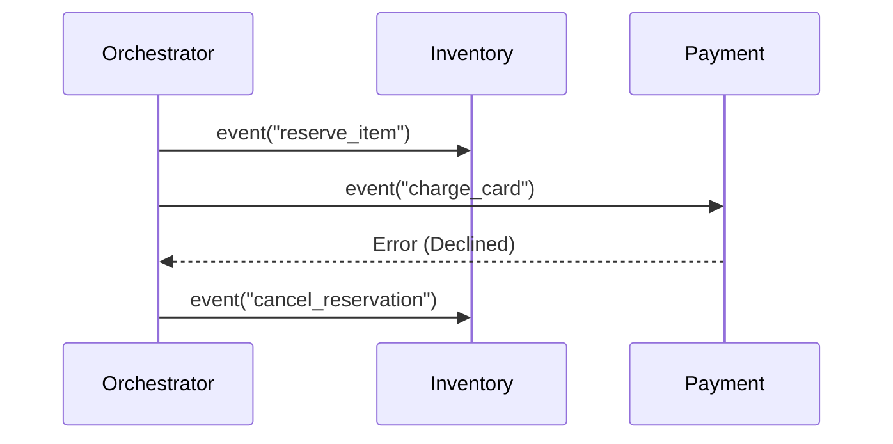

---

## 8. Leader-Follower
Work is delegated to a cluster of workers, often with one leader managing state.

**CommIPC Implementation**:
CommIPC natively handles the "Follower" delegation via `@app.group("workers")`. Because the Hub defaults to `lb_policy="least-active"`, the Hub automatically acts as the implicit leader, routing work to the least busy follower.

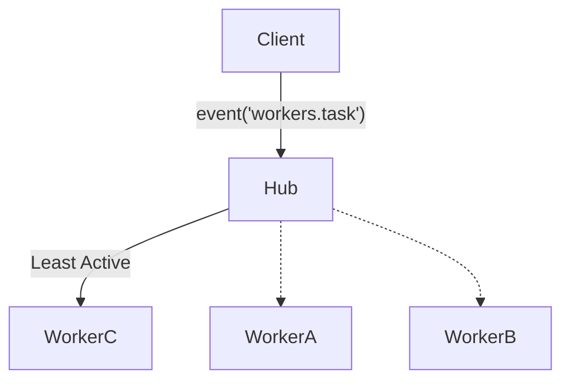

---

## 9. Sidecar Pattern
Deploying helper components alongside an application to provide networking or monitoring capabilities.

**CommIPC Implementation**:
Deploy a lightweight CommIPC Python script as a sidecar container in a Kubernetes pod. A legacy application (written in C++ or Go) talks to the Python sidecar via local HTTP/TCP, and the Python sidecar bridges the traffic to the CommIPC Hub.

---

## 10. Ambassador Pattern
An out-of-process proxy that handles network routing and retries on behalf of a client.

**CommIPC Implementation**:
Use `CommIPCBridge` deployed locally on a machine. Local microservices connect to the bridge via `/tmp/local.sock`, and the Bridge handles the complex TLS connection over the internet to the remote central Hub.

---

## 11. Bulkhead Pattern
Isolating components into pools so that if one fails, the others continue to function.

**CommIPC Implementation**:
Run multiple independent `CommIPCServer` instances on different sockets/ports. Connect critical services to `critical.sock` and background jobs to `background.sock`. If the background server crashes from memory exhaustion, the critical server is unaffected.

---

## 12. Circuit Breaker
Preventing a client from continuously attempting an operation that's likely to fail.

**CommIPC Implementation**:
Wrap `channel.event` calls in the client with timeout and failure thresholds. If X timeouts occur, the client stops sending RPCs and returns a cached/fallback response immediately.

```python
try:
    res = await asyncio.wait_for(channel.event("flakey_service", data), timeout=2.0)
except asyncio.TimeoutError:
    circuit_breaker.record_failure()
    return fallback_data()
```

---

## 13. Backend for Frontend (BFF)
Creating specific backend services tailored for specific frontend interfaces (e.g., Mobile vs Web).

**CommIPC Implementation**:
Use the `CommAPI` FastAPI bridge. A mobile frontend makes a single REST request to `/api/mobile/dashboard`. The FastAPI BFF concurrently fires 5 different `comm_ipc` RPC calls to microservices, aggregates the `CommData`, and returns a single JSON blob to the phone.

---

## 14. Strangler Fig Pattern
Incrementally migrating a legacy system by gradually replacing specific pieces of functionality.

**CommIPC Implementation**:
Place the `CommAPI` FastAPI gateway in front of the legacy API. As you rewrite legacy endpoints into CommIPC microservices, you mount them in the gateway using `comm_api.add_event()`. The gateway intercepts the modernized routes and proxies the rest to the legacy monolith.

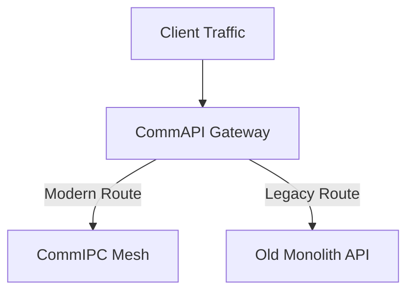

---

## 15. Full-Duplex Web-to-IPC Proxy
A hybrid bidirectional pattern for bridging targeted client actions (Inbound) and real-time mesh broadasts (Outbound) over a single WebSocket connection.

**CommIPC Implementation**:
The bridge sets up two concurrent task loops. For inbound messages, the browser makes 1-to-1 targeted **RPC Event Calls** (`channel.event(event_name, data)`). For outbound messages, internal IPC clients broadcast messages via **Pub/Sub** (`channel.publish(event_name, data)`) directly to the web client.

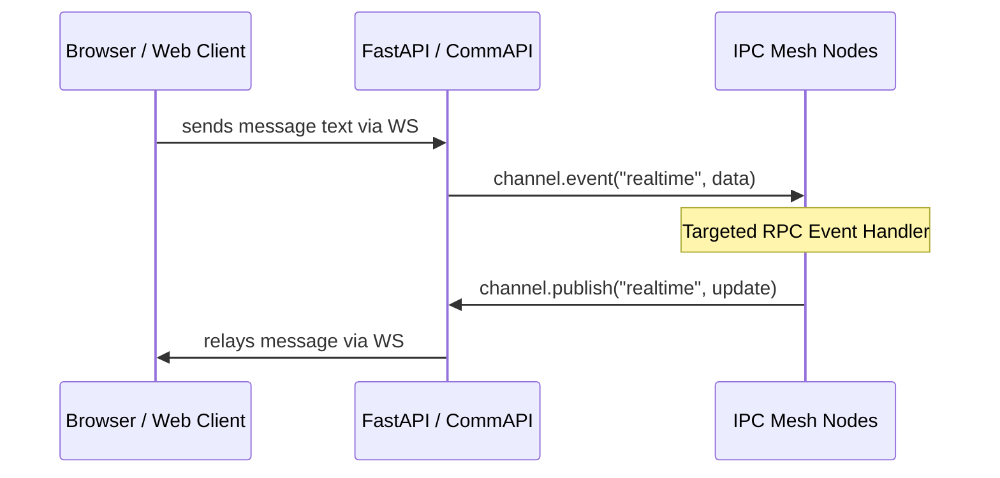

---

## 16. Two-Way Targeted RPC/Streaming Response over WebSocket
An RPC-over-WebSocket pattern where the client sends a single targeted request and receives the direct single response (or multiple responses from a stream) immediately over that same socket.

**CommIPC Implementation**:
Use `CommAPI.add_rpc_websocket()`. The bridge waits for the client to send message text. When a message is received, it invokes `channel.stream()` or `channel.event()` on the target event, and streams the chunk or object directly back to the web client over that same WebSocket.

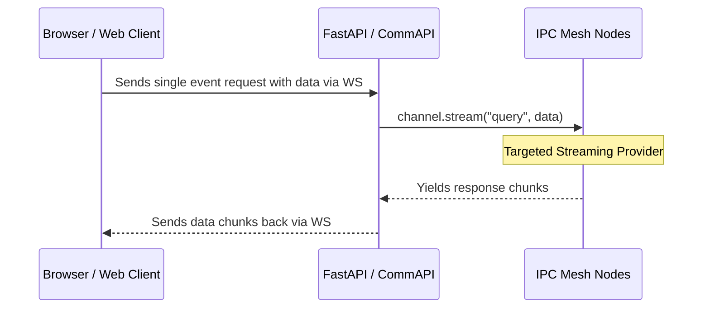

---

## 17. HTTP Server-Sent Events (SSE) with Input Parameters
A one-way push pattern where the browser initiates a live, continuous Server-Sent Events (SSE) stream using URL path variables, headers, or query parameters as the initial payload.

**CommIPC Implementation**:
Subscriptions in the underlying IPC mesh do **not** accept any input or filtering parameters. Therefore, the FastAPI backend uses any provided URL query parameters (e.g. `limit`) locally to control stream termination or filtering at the gateway level, then opens a standard subscription to the targeted topic using `CommAPI.add_subscription()`.

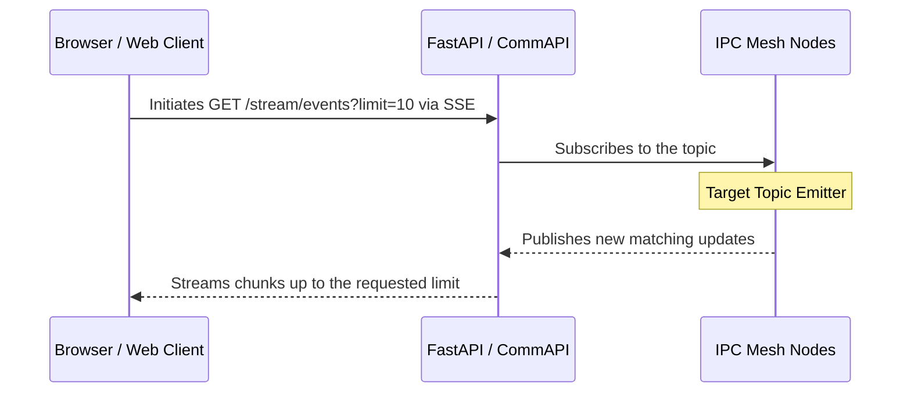

---

## 18. WebSocket SSE with Initial User Input/Payload
A pattern that emulates an SSE-like stream inside a WebSocket, where the browser first sends an initial payload (e.g. JSON configuration) to the socket, which immediately kicks off a targeted server stream.

**CommIPC Implementation**:
Because underlying IPC subscriptions accept no input payload, to pass initial filtering/configuration arguments directly into the stream provider, developers use `CommAPI.add_rpc_websocket()`. The client transmits its initial request parameters, and the bridge delegates them directly to a targeted streaming IPC event using `channel.stream(event_name, data)`.

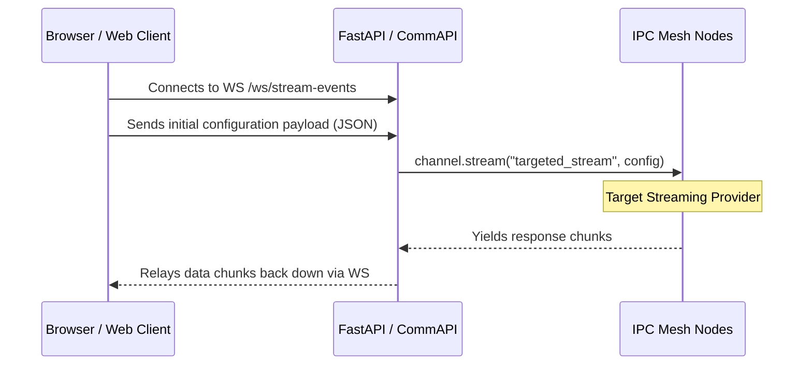

---

## 19. Filter and Forward
A pattern used to decouple high-volume data ingestion from downstream AI systems. An intermediary processing node listens to a raw data topic, filters out noise, transforms the data into valid feature vectors, and forwards the refined data to targeted AI training or execution pipelines.

**CommIPC Implementation**:
An AI preprocessing client subscribes to a high-throughput topic (e.g., `raw_telemetry`) using `channel.subscribe()`. Inside the callback, it applies data validation, normalization, and feature extraction. If the data meets quality thresholds, it publishes the transformed payloads to targeted topics (e.g., `model_training_data` for continuous offline learning, and `realtime_inference` for live AI execution) using `channel.publish()`.

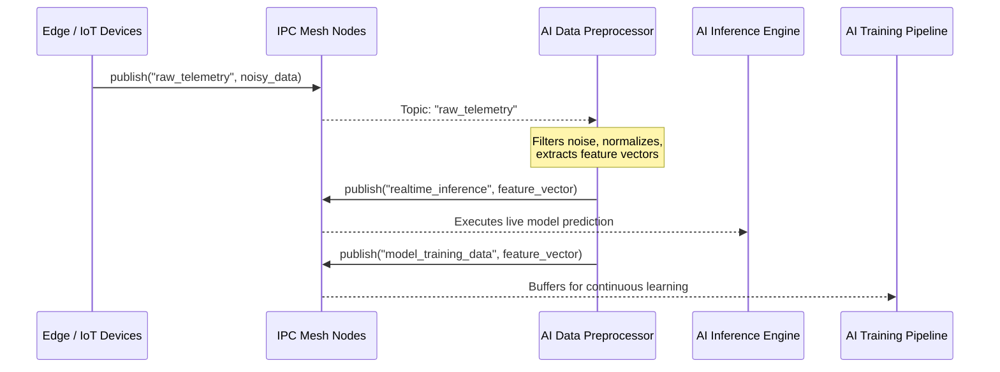

---

## 20. Event-Driven AI Pipeline
A non-subscription based pipeline where data is explicitly pushed through a sequence of processing nodes using targeted RPC events. This provides tighter execution control, guaranteed delivery, and clear error handling compared to pub/sub broadcasts, making it ideal for deterministic, multi-stage AI inference chains.

**CommIPC Implementation**:
A client submits data to an initial preprocessing event (e.g., `channel.event("ai.preprocess", raw_data)`). The processing node executes its task, and instead of returning the final result immediately to the caller or publishing to a broad topic, it directly invokes the next stage in the pipeline (`channel.event("ai.inference", tensor)`). Using targeted events ensures that each processing stage is explicitly routed and awaited.

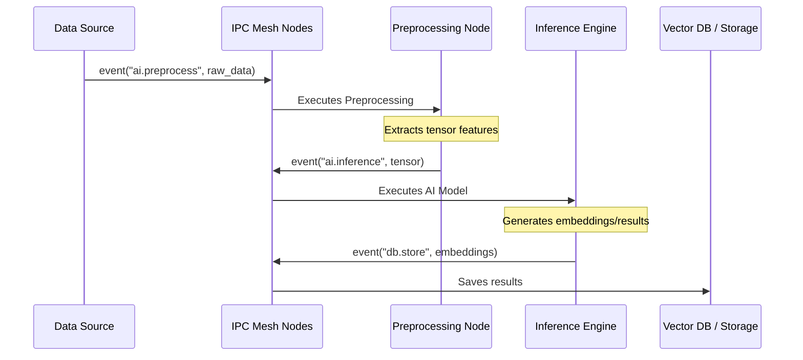
